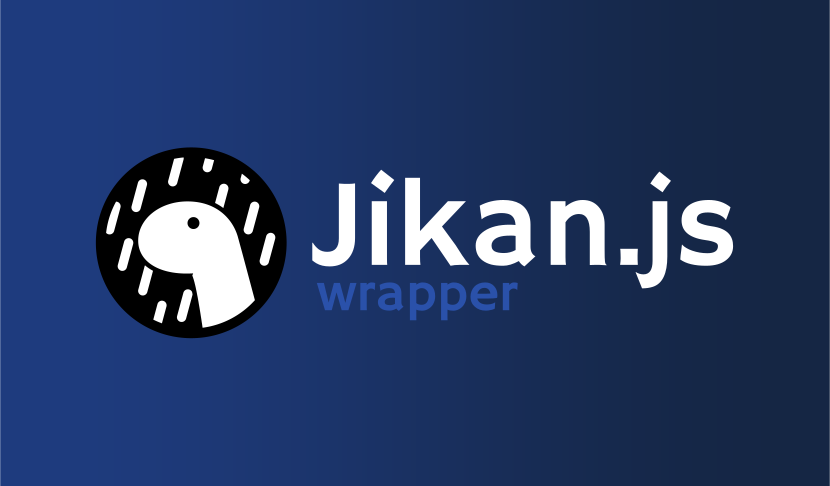

# Jikan.js - Unofficial Jikan API Wrapper for Deno 🚀


**Jikan.js** is a **simple**, **efficient**, and **easy-to-use** library for
interacting with the [Jikan API](https://github.com/jikan-me/jikan) — a RESTful
API that brings MyAnimeList data to your fingertips!

Built with ❤️ in TypeScript, Jikan.js is designed for Deno and comes with
powerful features like **rate-limiting**, **caching**, and **self-hosted API
support**. Whether you're building the next anime tracker or just want to fetch
your favorite characters, Jikan.js has you covered!

⚠️ **Heads up!** This library is still a work in progress. The first release is
coming soon, but you're welcome to follow along and share your feedback! 🙌

---

## ✨ Why Jikan.js?

1. **Unleash the Power of MyAnimeList:** Fetch anime, manga, characters, and
   more with ease!
2. **No More Rate-Limit Headaches:** Built-in queue system to keep things
   smooth.
3. **Cache It Like a Pro:** Cache responses to save time and bandwidth.
4. **Fully Typed:** Enjoy TypeScript's sweet autocompletion and safety.
5. **Customizable:** Use the official Jikan API or your self-hosted version.

---

## 🌟 Features (So Far...)

- ✅ Fetch data effortlessly from the Jikan API.
- ✅ Queue system to handle rate limits like a champ.
- ✅ Interfaced responses for clean and easy data handling.
- 🔄 Cache system to store responses for reuse (**in progress**).
- ✅ Support for self-hosted Jikan API setups.

💡 **Coming Soon:**

- Full Jikan API v4 support, NodeJS support (or alternative repo), automatic
  retries, and more!

---

## 🚧 Roadmap to Awesomeness 🗺️

<table>
  <thead>
    <tr>
      <th>Feature</th>
      <th>Status</th>
	  <th>Will be in first stable release?</th>
    </tr>
  </thead>
  <tbody>
    <tr>
      <td>Stable release</td>
      <td>🔄 In Progress</td>
	  <td>Obviously 🥲</td>
    </tr>
    <tr>
      <td>Full documentation</td>
      <td>❌ Not Started</td>
	  <td>Maybe after❔</td>
    </tr>
    <tr>
      <td>Queue system to prevent rate limiting</td>
      <td>✅ Complete</td>
	  <td>✅</td>
    </tr>
    <tr>
      <td>Interfaced responses for easy access to data</td>
      <td>✅ Complete</td>
	  <td>✅</td>
    </tr>
    <tr>
      <td>Cache system to store responses for a certain amount of time</td>
      <td>🔄 In Progress</td>
	  <td>✅</td>
    </tr>
    <tr>
      <td>Support for self-hosted Jikan API</td>
      <td>✅ Complete</td>
	  <td>✅</td>
    </tr>
    <tr>
      <td>Support for authenticated requests</td>
      <td>❌ Not Started</td>
	  <td>❌</td>
    </tr>
	<tr>
	  <td>Support for request retries (not part of stable)</td>
	  <td>❌ Not Started</td>
	  <td>❌</td>
    <tr>
      <td>
        <details>
          <summary>Full support for Jikan API v4</summary>
          <table>
            <thead>
              <tr>
                <th>Sub-feature</th>
                <th>Status</th>
              </tr>
            </thead>
            <tbody>
              <tr>
                <td>Anime</td>
                <td>✅ Complete</td>
              </tr>
              <tr>
                <td>Characters</td>
                <td>✅ Complete</td>
              </tr>
              <tr>
                <td>Clubs</td>
                <td>❌ Not Started</td>
              </tr>
              <tr>
                <td>Genres</td>
                <td>❌ Not Started</td>
              </tr>
              <tr>
                <td>Magazines</td>
                <td>❌ Not Started</td>
              </tr>
              <tr>
                <td>Manga</td>
                <td>🔄 In Progress</td>
              </tr>
              <tr>
                <td>People</td>
                <td>❌ Not Started</td>
              </tr>
              <tr>
                <td>Producers</td>
                <td>❌ Not Started</td>
              </tr>
              <tr>
                <td>Random</td>
                <td>❌ Not Started</td>
              </tr>
              <tr>
                <td>Recommendations</td>
                <td>❌ Not Started</td>
              </tr>
              <tr>
                <td>Reviews</td>
                <td>❌ Not Started</td>
              </tr>
              <tr>
                <td>Schedules</td>
                <td>❌ Not Started</td>
              </tr>
              <tr>
                <td>Users</td>
                <td>❌ Not Started</td>
              </tr>
              <tr>
                <td>Seasons</td>
                <td>❌ Not Started</td>
              </tr>
              <tr>
                <td>Top</td>
                <td>❌ Not Started</td>
              </tr>
              <tr>
                <td>Watch</td>
                <td>❌ Not Started</td>
              </tr>
            </tbody>
          </table>
        </details>
      </td>
      <td>🔄 In Progress</td>
	  <td>✅</td>
    </tr>
  </tbody>
</table>

## 🚀 Getting Started

### 🛠️ Importing the Library

**Note:** This library isn’t on the Deno registry yet. Stay tuned for updates!

To try it out now:

```typescript
import { JikanClient } from "https://raw.githubusercontent.com/RPDJF/Jikan.js/refs/heads/main/src/index.ts";
```

### 🎯 Example Usage

Here is an example of how you can use the library to fetch data from the Jikan
API:

```typescript
const client = new JikanClient();

client.getCharacter(1).then((character) => {
  console.log(character.name);
});
```

You also can use your own self-hosted Jikan API:

```typescript
const client = new JikanClient({
  host: "https://my-jikan-api.com",
  baseUri: "/v4",
});
```

**Pro Tip**: Always handle errors gracefully:

```typescript
try {
  const character = await client.getCharacter(1);
  console.log(character.name);
} catch (error) {
  console.error(error);
}
```

## 💬 What is Jikan API?

[Jikan API](https://github.com/jikan-me/jikan) is an **unofficial MyAnimeList
API** that scrapes MAL data. It provides information on anime, manga,
characters, schedules, and more!

**Why Jikan over MAL’s official API?**

- More features (e.g., character & staff info).
- No weird rate limit mysteries.
- Community-driven goodness.

---

## 🌌 Why Deno?

Deno is **secure**, **fast**, and **modern** — the perfect playground for this
library! Plus, it’s a refreshing break from Node.js. 🦕

---

## 🛤️ What’s Next?

I’m just getting started! Stay tuned for more features and a polished first
release. Want to contribute or share ideas? Open an issue or fork the repo — I’d
love to learn from you! 😊

---

## 📜 License

This project is licensed under the MIT License. Use it, share it, and don’t
forget to give a ⭐ if you like it!

---

✨ **Let’s build something awesome together!** ✨
